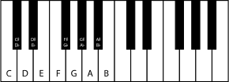

# ScaleBook
Musical scale resource website by Leland Jansen.

## Algorithms explained

### Introduction
Before diving into the algorithms, it is important to know a bit of music theory.

#### Piano Keyboard
Two octaves of a piano keyboard. One octave is comprised of 12 keys. A full piano keyboard has 88 keys.

#### Semitones
A semitone is simply the distance between two adjacent notes (white or black). For example, one semitone is the distance between the notes:
- C and C-sharp
- E and F
- G and A-flat
- et cetera

A tone is equivalent to two semitones, or the distance between three adjacent notes. For example, one tone is the distance between the notes:
- C and D
- E and F-sharp
- B-flat and C
- et cetera

#### Scales
A musical scale is a pattern of notes arranged in ascending or descending order of pitch. For example, the major (ionian) scale follows the semitone pattern:
2 | 2 | 1 | 2 | 2 | 2 | 1

A scale may start on any note. The C major scale starts on the note C and follows the major scale pattern. The second note of the scale is two semitones above the first note, the third note is two semitones above the second note, the fourth note is one semitone above the third note, et cetera. Thus, the notes of the C major scale are:
C | D | E | F | G | A | B | (C)

ScaleBook knows the following scales:
- Major
- Minor
- Ionian
- Dorian
- Phrygian
- Lydian
- Mixolydian
- Aeolian
- Locrian
- Blues
- Chromatic
- Pentatonic
- Whole tone

Songs and other musical compositions are usually built upon a scale, meaning the notes in that piece are based on the pitches given by the scale's semitone pattern. Thus, a piece can start on any note and still sound similar. For example, Twinkle Twinkle Little Star is based on the major scale. In C major, the first seven notes are:
C | C | G | G | A | A | G
Whereas in G major, the first seven note are:
G | G | D | D | E | E | D
Et cetera.

One will notice that the semitone distance between notes in both C major and G major are identical.

The two most common scales are the major and minor scales, often described as sounding "happy" and "sad", respectively.

#### Key signatures
