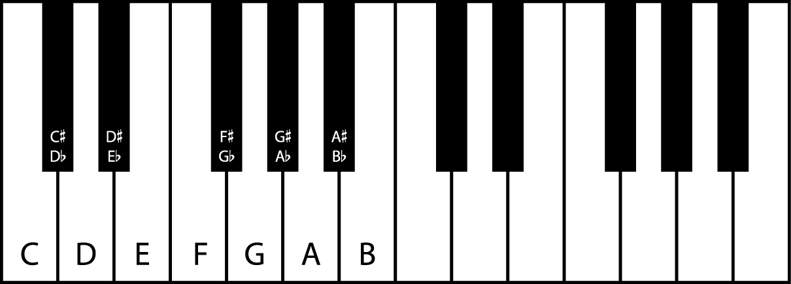

# ScaleBook
Musical scale resource website by Leland Jansen. From the initial sketches to the code thus far, everything has been created independently and coded from scratch.


## Contents
- [Natural language processing](#natural-language-processing)
  - [Some things you can ask ScaleBook](https://github.com/lelandjansen/ScaleBook#some-things-you-can-ask-scalebook)
- [Introduction and music theory](#enharmonics)
  - [Piano Keyboard](#piano-keyboard)
  - [Enharmonics](#enharmonics)
  - [Semitones](#semitones)
  - [Scales](#scales)
  - [Key signatures](#key-signatures)
  - [Relative scales](#relative-scales)
  - [Circle of Fifths](#circle-of-fifths)
- [Algorithms](#algorithms)
  - [scaleScore array](#scalescore-array)
  - [generateScale](#generatescale)
  - [Determine note, scale, and key signature](#determine-note-scale-and-key-signature)
    - [modeConversion array](#modeconversion-array)
    - [determineNote](#determinenote)
    - [determineScale](#determinescale)
    - [determineKeySignature](#determinekeysignature)
    - [checkInput](#checkinput)
  - [parseUserInput](#parseuserinput)
- [Attributions](#attributions)


## Natural language processing
ScaleBook understands natural language meaning you can ask it a query in your own words. The [parseUserInput algorithm](#parseuserinput) is responsible for processing the user's natural language.

### Some things you can ask ScaleBook
Scales
- C major
- blues on fs
- e double sharp triple flat minor
- G sharp major (gives enharmonically equivalent A-flat major because G-shrap minor cannot be written with a standard key signature)
- show me a flat miner scale on e (correctly interprets as E-flat minor, not A-flat minor)

Key signatures
- What's the key signature of C-flat major?
- d min ks
- Which modes have a key of 3 flats?
- No sharps or flats
- go to the mixolydian scale with 4 flats

Check
- Is F minor's key signature 1 flat?
- does a# min not have 7 sharps
- c minor has no flats and no sharps, right?

Relative scales
- What is the relative major of G minor?
- cb maj rel locrian
- show me all the scales relative to d sharp dorian

Random scale
- Generate a random scale
- eb random
- give me whatever whole tone scale you want

Fun
- Richter scale
- Decibel scale
- On a scale from 1 to 10...


## Introduction and music theory
Before diving into the algorithms, it is important to know a bit of music theory.

Click [here](#algorithms) to skip the theory and go straight to the algorithms.

#### Piano Keyboard
Two octaves of a piano keyboard are shown below with note names written on the keys of the first octave. Each octave is comprised of 12 keys, seven white notes and five black nots. A full piano keyboard has 88 keys.


#### Enharmonics
Two notes are said to be enharmonically equivalent if they have different names but represent the same note. The following are examples of enharmonic equivalents:
- C-sharp, D-flat
- F-sharp, D-flat
- B, C-flat
- Etc.

#### Semitones
A semitone is the distance between two adjacent notes (white or black). For example, one semitone is the distance between the notes:
- C and C-sharp
- E and F
- G and A-flat
- Etc.

A tone is equivalent to two semitones, or the distance between three adjacent notes. For example, one tone is the distance between the notes:
- C and D
- E and F-sharp
- B-flat and C
- Etc.

The sharp symbol when placed directly before a note raises that note by one semitone. Similarly, the flat symbol lowers a note by one semitone.

#### Scales
A musical scale is a pattern of notes arranged in ascending or descending order of pitch. For example, the major (ionian) scale follows the semitone pattern:

2 | 2 | 1 | 2 | 2 | 2 | 1

A scale may start on any note. The [C major](http://www.scalebook.org/scale?/C/#/major) scale starts on the note C and follows the major scale pattern. The second note of the scale is two semitones above the first note, the third note is two semitones above the second note, the fourth note is one semitone above the third note, et Etc. Thus, the notes of the C major scale are:

C | D | E | F | G | A | B | (C)

ScaleBook knows the following scales:
- Major
- Minor
- Ionian
- Dorian
- Phrygian
- Lydian
- Mixolydian
- Aeolian
- Locrian
- Blues
- Chromatic
- Pentatonic (part of major)
- Whole tone

Songs and other musical compositions are usually built upon a scale, meaning the notes in that piece are based on the pitches given by the scale's semitone pattern. Thus, a piece can start on any note and still sound similar. For example, *Twinkle Twinkle Little Star* is based on the major scale. In [C major](http://www.scalebook.org/scale?/C/#/major), the first seven notes are:

C | C | G | G | A | A | G

Whereas in [G major](http://www.scalebook.org/scale?/G/#/major), the first seven note are:

G | G | D | D | E | E | D

One will notice that the semitone distance between notes in both [C major](http://www.scalebook.org/scale?/C/#/major) and [G major](http://www.scalebook.org/scale?/G/#/major) are identical. Therefore, the song will still sound similar despite starting on a different note.

The two most common scales are the major and minor scales.

#### Key signatures

When writing and reading music, it is often laborious to have each accidental (i.e. sharp or flat) written before each note, especially when written in a key signature with may accidentals. Therefore, music is often written using a key signature - a series of sharps or flats that are (usually) placed on the music staff right after the clef. The notes on which the key signature accidentals are placed automatically raise/lower it by one semitone.

For example, the scale [E-flat major](http://www.scalebook.org/scale?/E-flat/#/major) major (notes: E-flat | F | G | A-flat | B-flat | C | D) has a key signature of three flats. Therefore, each time the notes B, E, or A appear, they are to be lowered by one semitone.

Typical key signatures can have up to seven sharps or seven flats.

The order in which the sharps/flats are written is described below:

Sharps: F, C, G, D, A, E, B

Flats: B, E, A, D, G, C, F

One may notice that the notes are each separated by seven semitones, and that the flat pattern is the reverse arrangement of the sharps pattern.


#### Relative scales
Two scales are said to be relative if they share the same notes and thus the same key signature. For example, [C minor](http://www.scalebook.org/scale?/C/#/minor) is relative to [E-flat major](http://www.scalebook.org/scale?/E-flat/#/major) major (key signature of three flats).

[E-flat major](http://www.scalebook.org/scale?/E-flat/#/major): E-flat | F | G | A-flat | B-flat | C | D

[C minor](http://www.scalebook.org/scale?/C/#/minor): C | D | E-flat | F | G | A-flat | B-flat

The following table describes the distance between relative scales:

| Scale         | Distance to major scale (semitones) |
| ------------- | ----------------------------------- |
| Major/Ionian  | 0                                   |
| Dorian        | 2                                   |
| Phrygian      | 4                                   |
| Lydian        | 5                                   |
| Mixolydian    | 7                                   |
| Minor/Aeolian | 9                                   |
| Locrian       | 11                                  |

For example, to find the relative minor of [E-flat major](http://www.scalebook.org/scale?/E-flat/#/major), go up nine semitones from E-flat to C. Thus, [C minor](http://www.scalebook.org/scale?/C/#/minor) is the relative minor of [E-flat major](http://www.scalebook.org/scale?/E-flat/#/major).


#### Circle of Fifths
To determine a major scale's key signature, one can use the *Circle of Fifths*. Below are the steps required to do so:

1. Start on the note C,
2. Go up seven semitones,
3. Repeat step 2 (up to seven times) until one lands on the desired note,
4. The number of times step 2 was repeated gives the number of sharps in the key signature.

For example, to find the key signature of [D major](http://www.scalebook.org/scale?/D/#/major), start on the note C and go up seven semitones to G, then up another seven semitones to D. Since D is the desired note and seven semitones were added twice, the key signature of [D major](http://www.scalebook.org/scale?/D/#/major) is 2 sharps.

A similar process may be used to determine the number of flats by instead going down seven semitones (starting on the note C).

Any scale's key signature can be found by first finding its relative major.


## Algorithms
Below is an outline of ScaleBook's major algorithms, each developed independently and from scratch.

ScaleBook assigns each note a number as outlined in the table below:

| Number | Note name      |
| ------ | -------------- |
| 0      | C              |
| 1      | C-sharp/D-flat |
| 2      | D              |
| 3      | D-sharp/E-flat |
| 4      | E              |
| 5      | F              |
| 6      | F-sharp/G-flat |
| 7      | G              |
| 8      | G-sharp/A-flat |
| 9      | A              |
| 10     | A-sharp/B-flat |
| 11     | B              |

Additionally, key signatures are treated as numbers (positive for sharp, negative for flat).

#### scaleScore array
The scaleScore array is used to determine what information has been provided by the user, namely the scale type, note name, and accidental. Each time an occurrence of the *item* is found, that element's *value* is added to the *total*. The total can then be used to determine more easily what information has been provided.

```javascript
// Scale Score table
var scaleScore = [

// item            value  total

  [ // Scale
  ["major",       1,    0], // major
  ["minor",       1,    0], // minor
  ["ionian",      1,    0], // ionian
  ["dorian",      1,    0], // dorian
  ["phrygian",    1,    0], // phrygian
  ["lydian",      1,    0], // lydian
  ["mixolydian",  1,    0], // mixolydian
  ["aeolian",     1,    0], // aeolian
  ["locrian",     1,    0], // locrian
  ["blue",       10,    0], // blues
  ["chromatic",  10,    0], // chromatic
  ["pentatonic", 10,    0], // pentatonic
  ["whole",      10,    0]  // whole tone
  ],

  [ // White Note
  ["c",      1,    0], // c
  ["d",      1,    0], // d
  ["e",      1,    0], // e
  ["f",      1,    0], // f
  ["g",      1,    0], // g
  ["a",      0.1,  0], // a
  ["b",      1,    0]  // b
  ],

  [ // Accidental
  ["natural",   0,    0], // natural
  ["sharp",     1,    0], // sharp
  ["flat",     -1,    0]  // flat
  ]

];
```

### generateScale
ScaleBook uses the starting note and semitone pattern to generate scales.

To determine which enharmonic to use for the accidentals of seven-note scale:

1. The scale is written as an array of numbers using the starting note and semitone pattern.
2. An array of seven sequential white note numbers is written. In the case where the starting note is not a white note, the natural of that note is used.
3. The array's elements are subtracted from one another into a third array. The result gives the accidental of each note (i.e. -1 for flat, 0 for natural, 1 for sharp).
4. The scale is then written out (with letters) using the white note number and accidental numbers.

Using this method, scales without a standard key signature (e.g. G-sharp major) can also be written correctly by using double sharps and flats.

For example, [E major](http://www.scalebook.org/scale?/E/#/major) is represented by the number 4 and major scales follow the semitone pattern:

2, 2, 1, 2, 2, 2, 1

Thus, the scale written as numbers is:

4, 6, 8, 9, 11, 13, 15

The white note sequence starting on E is:

4, 5, 7, 9, 11, 12, 14

Subtracting the two arrays gives:

0, 1, 1, 0, 0, 1, 1

Therefore, the notes of E major are:

E, F-sharp, G-sharp, A, B, C-sharp, and D-sharp


```javascript
function generateScale(startNoteName, scalePattern) {
  "use strict";

  var startNote = 0;
  var scaleArray =  [
                      [],  // MIDI notes
                      [],  // White notes MIDI
                      [],  // Accidental MIDI
                      []  // Written note
                    ];

  // Find the number corresponding with the start note name
  // Loop through each element of whiteNoteChart
  for (i = 0; i < whiteNoteChart.length; i++) {
    // If the first character of startNoteName matches the note name in whiteNoteChart
    if (startNoteName[0].toUpperCase() === whiteNoteChart[i][1]) {
      // Add the corresponding MIDI number to startNote
      startNote += whiteNoteChart[i][0];
      break;
    }
  }

  // Assign the first (zeroth) element of scaleArray White note MIDI to startNote
  scaleArray[1][0] = startNote;

  // Add seven consecutive white notes to white notes MIDI
  for (j = 1; j < whiteNoteChart.length; j++) {
    scaleArray[1][j] = (whiteNoteChart[(i+j)%7][0])%12;
  }

  // If startNoteName contains "sharp"
  if (startNoteName.indexOf("sharp") > -1) {
    // Add 1 to the startNote
    startNote += 1;
  }
  // If startNoteName contains "flat"
  else if (startNoteName.indexOf("flat") > -1) {
    // Subtract 1 from startNote
    startNote -= 1;
  }

  // Assign the first (zeroth) element of scaleArray MIDI note to startNote
  scaleArray[0].push(startNote);

  // Generate the scale using numbers
  // Loop through each element of scalePattern starting at the second element
  for (i = 1; i < scalePattern.length; i++) {
    // Add the element of scalePatten to the previous element of scalePattern
    // Convert to base 12
    scaleArray[0][i] = (scaleArray[0][i-1] + scalePattern[i-1])%12;
  }

  // Loop through the length of scalePattern
  for (i = 0; i < scalePattern.length; i++) {
    // Subtract the scale number from the white note number
    // Convert to base 12
    scaleArray[2][i] = (scaleArray[0][i] - scaleArray[1][i])%12;
    // If the subtraction results in 11 (this is necessary due to numbers being in base 12)
    if (scaleArray[2][i] === 11) {
      // Change 11 to -1
      scaleArray[2][i] = -1;
    }
  }

  // Initialize found variable (represents whether or not the whiteNote has been found)
  var found;
  // Loop through the length of the first element of scaleArray
  for (i = 0; i < scaleArray[0].length; i++) {
    // Set found to false (the white note has not yet been found)
    found = false;
    // Loop through the length of whiteNoteChart
    for (j = 0; j < whiteNoteChart.length; j++) {
      // If the note number in the first element of scaleArray matches
      // the number in the zeroth element of whiteNoteChart
      if (scaleArray[1][i] === whiteNoteChart[j][0]) {
        // Set the third element of scaleArray to the name of that white note
        scaleArray[3][i] = whiteNoteChart[j][1];
        // The whiteNote has been found
        found = true;
      }
      // If the second element of scaleArray is 1 (i.e. sharp)
      if (scaleArray[2][i] === 1) {
        // Add "-sharp" to the end of the white note name in the third element of scaleArray
        scaleArray[3][i] += "-sharp";
      }
      // If the second element of scaleArray is -1 (i.e. flat)
      else if (scaleArray[2][i] === -1) {
        // Add "-sharp" to the end of the white note name in the third element of scaleArray
        scaleArray[3][i] += "-flat";
      }
      // If the whiteNote was found
      if (found === true) {
        // Break out of the loop
        break;
      }
    }
  }

  return scaleArray;

} // End of generateScale
```

### Determine note, scale, and key signature
Using the concepts of relative scales and the *Circle of Fifths*, one can determine the starting note, scale type, or key signature of a particular scale scale given the other two pieces of information.

#### modeConversion array
The modeConversion array details the number of semitones by which a note must be lowered to arrive at its relative major.
```javascript
// List of semitones between scale and relative major
var modeConversion = [
  ["ionian",       0], ["major",  0],
  ["dorian",      -2],
  ["phrygian",    -4],
  ["lydian",      -5],
  ["mixolydian",  -7],
  ["aeolian",     -9], ["minor", -9],
  ["locrian",    -11]
];
```

#### determineNote
The starting note of a scale can be determined if the scale type and key signature are specified.
```javascript
// Find note given scale and key signature
function determineNote(scale, keySignature) {
  "use strict";

  // Loop through each element of modeConversion
  for (i = 0; i < modeConversion.length; i++) {
    // If the entry in the zeroth element of modeConversion matches the scale
    if (modeConversion[i][0] === scale) {
      // Scale is the number of semitones to relative major
      scale = modeConversion[i][1];
      break;
    }
  }

  // Find note using scale and key signature
  // Start on note 7 octaves above 0 (lowest MIDI C)
  // Go up (negative times negative) from relative major to relative scale
  // Go up/down 7 semitones (perfect fifth) times the key signature to find the starting note
  // Take modulus 12 to find note in first octave
  var note = (7*12 - scale + 7 * keySignature)%12;

  return note;

} // End of determineNote
```

#### determineScale
The scale type can be determined if the starting note and key signature are specified.
```javascript
// Find scale type given a starting note and key signature
function determineScale(note, keySignature) {
  "use strict";

  // Determine scale difference (between scale and its relative major)
  // Start on note 7 octaves above 0 (lowest MIDI C)
  // Go up/down 7 semitones (perfect fifth) times the key signature
  // Take modulus 12 to find note in first octave
  var scaleDifference = note + (12*7 - 7 * keySignature)%12;
  // Add 12 to scale to ensure positive value
  // Multiply by -1 to make negative
  // Take modulus 12 to find note in first octave (value is negative)
  scaleDifference = (-1 * (12 + scaleDifference))%12;

  // Declare scaleName
  var scaleName;
  // Loop through each element of modeConversion
  for (i = 0; i < modeConversion.length; i++) {
    // If the first element of modeConversion matches the value determined for scale
    if (modeConversion[i][1] === scaleDifference) {
      // Scale is the zeroth element of modeConversion (i.e. scale name)
      scaleName = modeConversion[i][0];
      break;
    }
  }

  return scaleName;

} // End of determineScale
```

#### determineKeySignature
The key signature of a scale can be determined if the starting note and scale type are specified.
```javascript
// Find the key signature given a starting note and scale
function determineKeySignature(note, scale) {
  "use strict";

  // Initialize keySignature and scaleIndex
  var keySignature, scaleIndex;

  // Loop through major, minor, and modes in scaleScore scale element
  for (i = 0; i < scaleScore[0].length; i++) {
    // If specified scale matches scale element of scaleScore
    if (scale === scaleScore[0][i][0]) {
      // Set the scaleIndex to the scale's position in scaleScore
      scaleIndex = i;
      break;
    }
  }

  // If the scale is not a major, minor, or mode (i.e. has scaleIndex greater than 8)
  if (scaleIndex > 8) {
    // The scale has a key signature of 0 sharps or flats
    keySignature = 0;
  }

  // Otherwise
  else {

    // Initially assign 0 to scaleDifference
    var scaleDifference = 0;
    // Get difference between ionian (major) scale and other scale using modeConversion array
    // Loop through modeConversion array
    for (i = 0; i < modeConversion.length; i++) {
      // If the zeroth element of modeConversion matches the scale
      if (modeConversion[i][0] === scale) {
        // Get the scaleDifference from the first element
        scaleDifference = modeConversion[i][1];
        break;
      }
    }

    // Find the relative major note
    var relativeMajorNote = note + scaleDifference;

    // Set key signature to 0 (no sharps or flats)
    keySignature = 0;

    // Test for sharp key signatures (up to 7 sharps)
    // If the relativeMajorNote is not C (i.e. 0) and the accidental scaleScore is greater than or equal to 0 (i.e. sharp)
    if (relativeMajorNote%12 !== 0 && sumScaleScore("accidental") >= 0) {
      // Loop through seven sharp key signatures
      for (i = 0; i < 8; i++) {
        // Go down seven semitones
        relativeMajorNote -= 7;
        // Increment key signature by one (add one sharp)
        keySignature += 1;
        // If relativeMajorNote is C
        if (relativeMajorNote%12 === 0) {
          break;
        }
      }
    }

    // If a sharp key signature is not found, test for flat key signatures (up to 7 flats)
    // If relativeMajorNote is not C (i.e. 0) and and the accidental scaleScore is less or equal to than 0 (i.e. flat)
    if (relativeMajorNote%12 !== 0 && sumScaleScore("accidental") <= 0) {
      // Reset relativeMajorNote by re-determining its value
      relativeMajorNote = note + scaleDifference;
      // Reset keySignature to zero
      keySignature = 0;
      // Loop through seven flat key signatures
      for (i = 0; i < 8; i++) {
        // Go up seven semitones
        relativeMajorNote += 7;
        // Decrement key signature by one (add one flat)
        keySignature -= 1;
        // If relativeMajorNote is C
        if (relativeMajorNote%12 === 0) {
          break;
        }
    }

    // If key signature is less than seven (has more than 7 flats)
    if (keySignature < -7) {
      // Reset relativeMajorNote by re-determining its value
      relativeMajorNote = note + scaleDifference;
      // Reset keySignature to zero
      keySignature = 0;
      // Loop through seven sharp key signatures
      for (i = 0; i < 8; i++) {
        // Go down seven semitones
        relativeMajorNote -= 7;
        // Increment key signature by one (add one sharp)
        keySignature += 1;
        // If relativeMajorNote is C
        if (relativeMajorNote%12 === 0) {
          break;
        }
      }
    }
    // If key signature is less than seven (has more than 7 sharps)
    else if (keySignature > 7) {
      // Reset relativeMajorNote by re-determining its value
      relativeMajorNote = note + scaleDifference;
      // Reset keySignature to zero
      keySignature = 0;
      // Loop through seven flat key signatures
      for (i = 0; i < 8; i++) {
        // Go up seven semitones
        relativeMajorNote += 7;
        // Decrement key signature by one (add one flat)
        keySignature -= 1;
        // If relativeMajorNote is C
        if (relativeMajorNote%12 === 0) {
          break;
        }
      }
    }

    // If key signature is still less than -7 (has more than 7 flats) or greater than 7 (has more than 7 sharps)
    if (keySignature < -7 || keySignature > 7) {
      // Key signature is 0 sharps or flats
      keySignature = 0;
    }

  } // End of else

  return Number(keySignature);

} // End of determineKeySignature
```

#### checkInput
If given the starting note, scale type, and key signature, one can determine if the three parameters agree.
```javascript
// Check if given scale on given note has given key signature
function checkInput(note, scale, keySignature) {
  "use strict";

  // If the specified key signature is equivalent to the computed key signature computed using the note and scale type
  if (Number(keySignature) === Number(determineKeySignature(note, scale))) {
    // The specified information agrees, thus is true
    return true;
  }
  else {
    // The specified information does not agree, thus is false
    return false;
  }

} // End of checkInput
```


### parseUserInput
Below is an outline of the parseUserInput algorithm ScaleBook uses for *Natural Language Processing*.

- String parsing
  - Collect user input from search field
  - Convert the string to lower case and remove/replace special characters
  - Split the string into an array with each word in its own element
  - Convert certain letters to accidentals
  - Correct spelling
  - Rewrite plural words, contractions, synonyms,
  - Replace written numbers with numeric numbers
  - Edit string around pronouns
  - Remove/replace keywords
  - Analyze string when multiple accidentals are present
- Get information from modified string array
  - Zero scaleScore totals
  - Determine key signature from string
  - Score scales, white notes, and accidentals in scaleScore
  - Modify scaleScore for special B-flat and A special case
  - Second special case for A
  - Determine if certain keywords are present in the string
  - Determine the scale type and note from scaleScore
- Action
  - Gather keyword, scale type, note, and key signature information
  - Perform necessary computations
  - Generate interpretation
  - Generate answer
  - Apply music formatting to the  interpretation and answer strings
- Return result

The complete parseUserInput function can be found in the file ScaleBook.js.


## Attributions
Although ScaleBook was designed and coded independently, it was made possible by the numerous online resources available to me. I would like to thank those who shared their knowledge and expertise to make this project possible.
